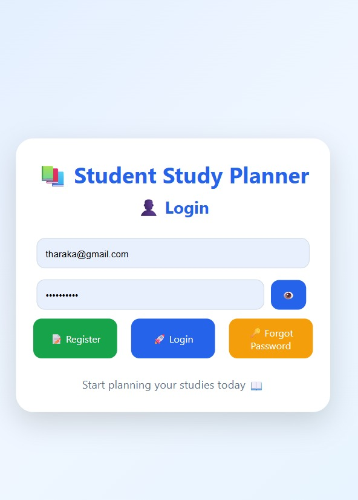
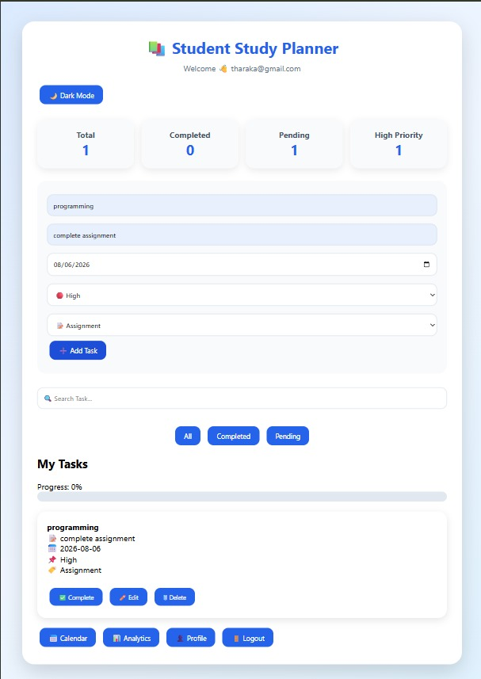
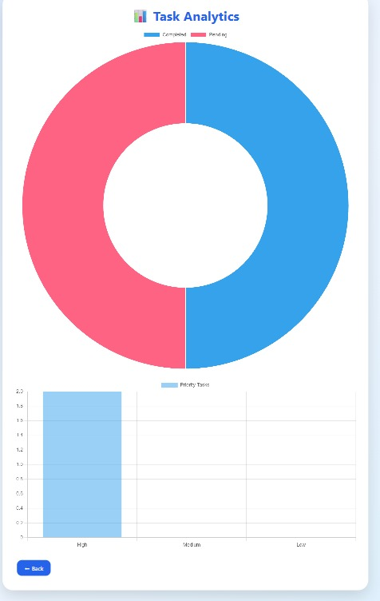

# 📚 Student Study Planner

A web-based study management application designed to help students organize tasks, manage deadlines, and track their academic progress efficiently.

## 🚀 Features

- 🔐 User Authentication
- 📝 Task Management
- ✅ Complete and Pending Task Tracking
- 📊 Analytics Dashboard
- 📅 Deadline Management
- ☁️ Firebase Cloud Database
- 🌙 Dark Mode Support

## 🛠️ Technologies Used

- HTML
- CSS
- JavaScript
- Firebase Authentication
- Firebase Firestore
- GitHub Pages

## 📸 Screenshots

### Login Page

### Dashboard

### Analytics Dashboard

## 🌐 Live Demo

https://hasadhi.github.io/student-study-planner/

## 💻 Source Code

https://github.com/hasadhi/student-study-planner

## 👩‍💻 Author

Hashadi Lakshika

Computer Science Undergraduate  
NSBM Green University